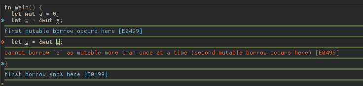

# flycheck-inline

[][LICENCE]
[](https://melpa.org/#/flycheck-inline)

This is an extension for [Flycheck][]. It implements a minor-mode for displaying
errors from Flycheck right below their reporting location, using overlays.


It also supports displaying *related errors* from Flycheck checkers that support
them.  Here is an example of this behavior for Rust borrowing errors:


(See also [flycheck-rust][flycheck-rust] for automatically setting up your Rust
projects for Flycheck)

## Installation

Add `flycheck-inline.el` somewhere to your `load-path` and add the following to
your init file:

```emacs-lisp
(with-eval-after-load 'flycheck
  (add-hook 'flycheck-mode-hook #'flycheck-inline-mode))
```

This will turn on inline errors in all buffers where Flycheck is activated.

## Configuration

The colors used to display the error/warning/info messages are inherited from
the compilation faces.  You can customize them through `M-x customize-group RET
flycheck-inline RET`.

If you wish to change the delay before errors are displayed, see
`flycheck-display-errors-delay`.

You can change the way overlays are created by customizing
`flycheck-inline-display-function` and `flycheck-inline-clear-function`.  Here
is an example using [quick-peek][] to display the overlays which adds bars
around them:

```emacs-lisp
(setq flycheck-inline-display-function
      (lambda (msg pos)
        (let* ((ov (quick-peek-overlay-ensure-at pos))
               (contents (quick-peek-overlay-contents ov)))
          (setf (quick-peek-overlay-contents ov)
                (concat contents (when contents "\n") msg))
          (quick-peek-update ov)))
      flycheck-inline-clear-function #'quick-peek-hide)
```

The result:



## Contributing

We welcome all kinds of contributions, whether you write patches, open pull
requests, write documentation, help others with issues, or just tell other
people about your experiences with this extension.

## License

This program is free software: you can redistribute it and/or modify it under
the terms of the GNU General Public License as published by the Free Software
Foundation, either version 3 of the License, or (at your option) any later
version.

This program is distributed in the hope that it will be useful, but WITHOUT ANY
WARRANTY; without even the implied warranty of MERCHANTABILITY or FITNESS FOR A
PARTICULAR PURPOSE.  See the GNU General Public License for more details.

You should have received a copy of the GNU General Public License along with
this program.  If not, see http://www.gnu.org/licenses/.

[LICENCE]: https://github.com/flycheck/flycheck-licence/blob/master/LICENCE
[contrib]: http://www.flycheck.org/en/latest/contributor/contributing.html
[flycheck-rust]: https://github.com/flycheck/flycheck-rust
[Flycheck]: http://www.flycheck.org/
[quick-peek]: https://github.com/cpitclaudel/quick-peek
